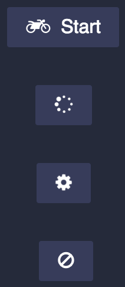

[](http://tckd.me/)

  A multiplayer Snake game powered by Nodejs

## Running

  Run the following command
```bash
$ node app.js
```

  Then open your browser to play
```web
http://localhost:3000
```

## Game states


```bash
init -> ready [user - explicit]
ready -> run [server - automatic]
run -> dead [server - automatic]
run -> won [server - automatic]
dead -> init [user - explicit]
won -> init [user - explicit]
```

## Features, Feature Requests, Bugs & Enhancements

### Features

  * Multiplayer mode - unlimited amount of players
  * Dynamic adjust to screen size when ever user resizes the screen

### Enhancements

  * Invite other snake players
  * Twitter, Facebook & linkedIn integration

### Bugs

  * Client code not running when window is not active, Possible to cheat, since snakes notifyes its dead.

### Feature Requests
  * Single player mode
  * Levels for single player mode
  * Ability to create custom levels/world
  * High score list for single player mode
  * Command search functionality (Inspiration: atom.io)
  * Wiced sensor controllable
  * Mobile support

## Architecture

### V1 (current) - Logic is running in clients

Design flaws with current Architecture:

  * Major inconsistency issues, as a result of latency
  * Client code not running when window is not active, Possible to cheat, since snakes notifies its dead.
  * Only one game instance at a time

Benefits of current Architecture
  * Scalable, due to less computation on server.

### V2 (To be) - Logic is executed in Server

Theoretically (to be tested), it will solve the inconsistency issues, however there will still be miner latancy issues

This will lead to greate stress on server resources...

### V3 (Todo) - Master-slaves on clients

Use webRTC in order to make one of the players the master.
Now possible to run multiple games at the same time.

### Inpirations to architectural approaches

  * http://12factor.net
